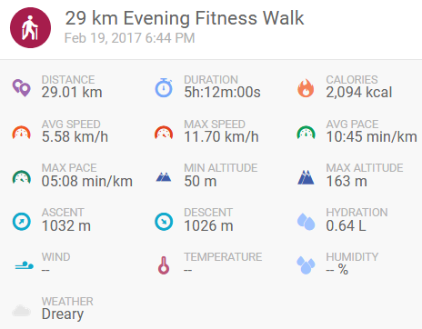
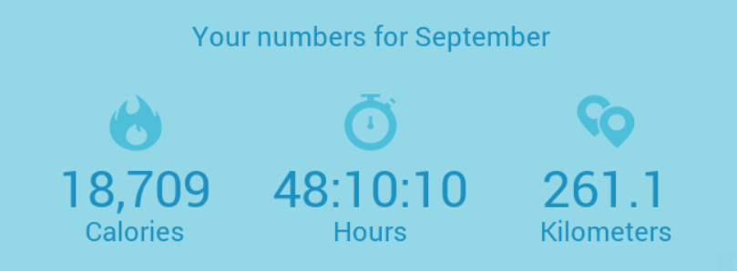

    

 

Graduated IT Technician and Bachelor of Engineering in <a href="http://wmii.uwm.edu.pl/f/images/Structure/whyolsztyn.pdf" target="_blank">Computer Science</a> interested into computers and it's capabilities since 2008 and since then tried music, videos, photos editing; <a href="https://gamebanana.com/maps/184254" target="_blank">level designing</a>; game developing in <a href="https://helion.pl/ksiazki/projektowanie-gier-w-srodowisku-unity-3-x-will-goldstone,prgun3.htm#format/e" target="_blank">Unity 3.x</a>. From the end of the year 2017, focused on constantly improving programming skills. Ambitious, open-minded and trustworthy person that likes to cooperate, create and help with encountered problems 

Besides sitting in front of the screen, I also like to spend time on kickboxing or outdoor activity, especially doing kilometers and gathering results in <s>endomondo</s> MapMyRun. For e.g. the biggest distance I've scored walking and overall stats from September 2020 

 

    

 

    

