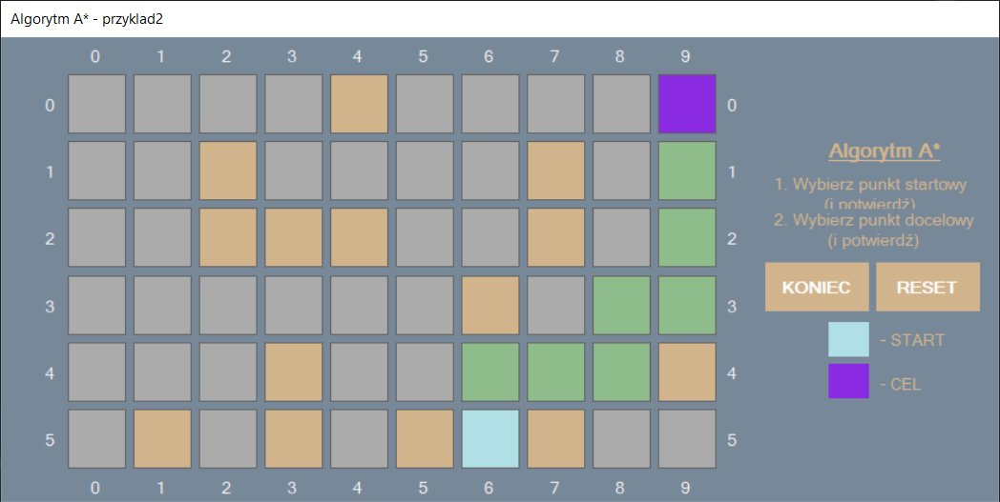

import GitHubButton from '../githubButton';
import Arrow from '../arrow';

<h4>About project</h4>

 

Approach to A* algorithm implementation in WinForms using Tuple data structure. I wanted to make one after reading  <a href="https://www.raywenderlich.com/3016-introduction-to-a-pathfinding" target="_blank">this article</a> from Johann Fradj. I am aware that solution isn't perfect because I struggled with case when from starting point A to dest B there is more than 1 path with the same "H" cost as shown in README on GitHub. From article we can read that "There are various solutions we could use, but one simple (and fast) way is to keep following the tile most recently added to the open list." but I cannot apply this to very first step :() If I have time I'll return to this :]

 

<Arrow/>

<GitHubButton url="https://github.com/trolit/Inne/tree/master/Algorytm%20A_star#o-algorytmie-a"/>