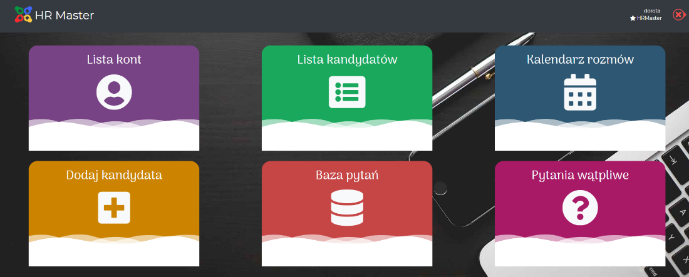

import GitHubButton from '../githubButton';

<h4>About project</h4>

 

🎓 ‍University team project which was done in 5 people(<a href="https://github.com/Dorota1997" target="_blank">Dorota1997</a>, <a href="https://github.com/damianggg" target="_blank">damianggg</a>, <a href="https://github.com/gradampl" target="_blank">gradam</a>, <a href="https://github.com/Michal2017" target="_blank">Michal2017</a>). I was responsible for team leading, and mainly backend implementation. I also helped with frontend when backend was already finished. In short, app was designed to drastically improve recruitment process for HR team. Visacom representatives were very satifised with outcome achieved until project deadline, 06.2019 👑

 

